## CubeIDE新建LED闪烁工程

本系列教程均基于正点原子 `L475` 潘多拉开发板为硬件平台。项目开源地址 [github 地址](https://github.com/tyustli/threadx-l475)

### 选择工作空间

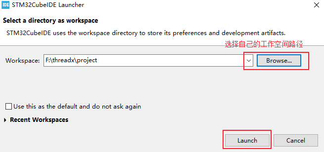

### 基于 cubemx 新建工程

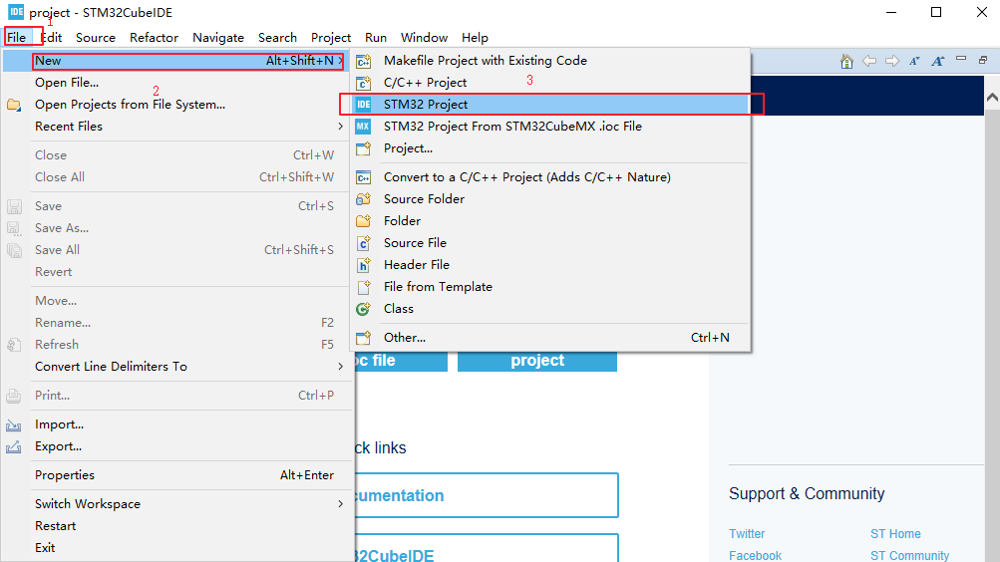

### 选择 CPU

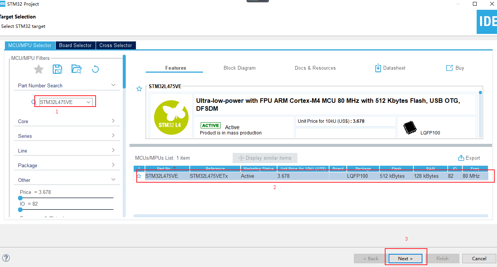

### 工程名称配置

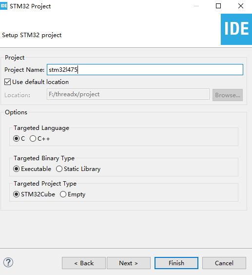

### 设置下载方式

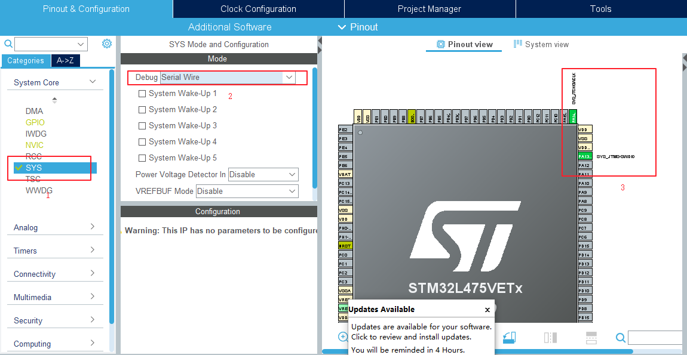

### 配置 LED 引脚

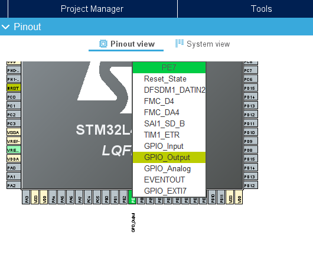

### 配置系统时钟

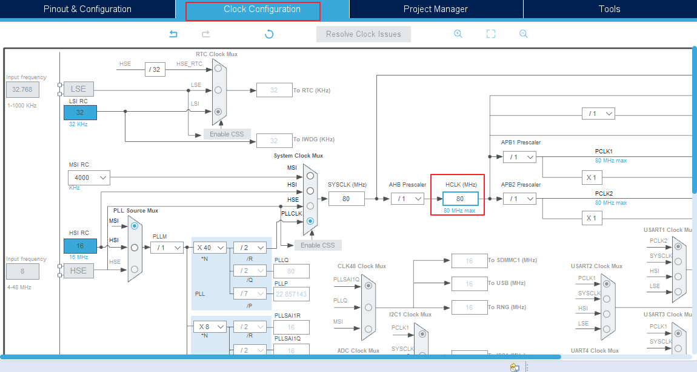

### 配置文件保存路径

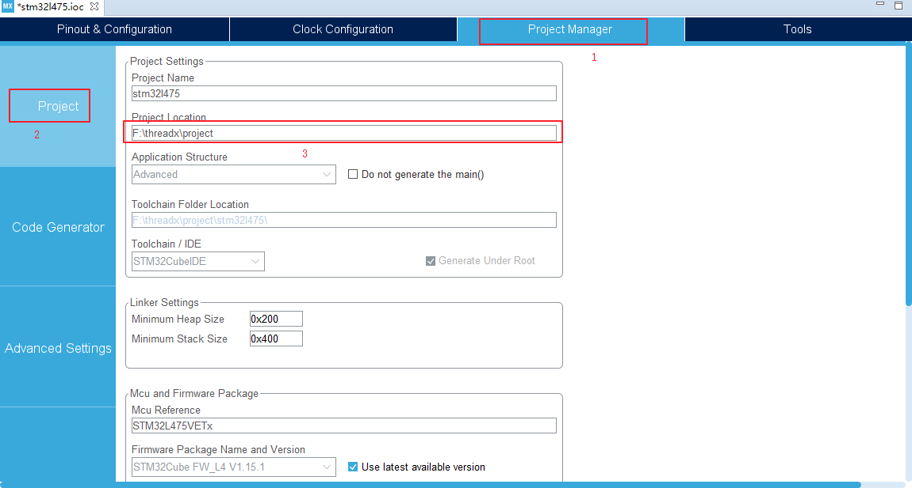

### 生成代码

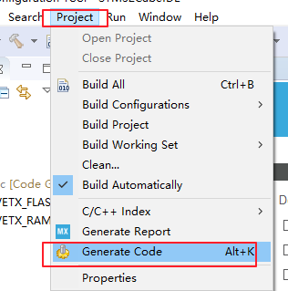

### LED 闪烁程序

在 `main.c` 文件的 `main` 函数的 `while(1)` 中添加 `LED` 闪烁代码
```c
while (1)
{
    /* USER CODE END WHILE */
    HAL_GPIO_WritePin(GPIOE, GPIO_PIN_7, GPIO_PIN_RESET);
    HAL_Delay(1000);
    HAL_GPIO_WritePin(GPIOE, GPIO_PIN_7, GPIO_PIN_SET);
    HAL_Delay(1000);
    /* USER CODE BEGIN 3 */
}
```
### 编译下载

点击工具栏的 `Debug main.c`  按钮开始调试，此时报错

```c
Lanuching stm32l475 Debug has encountered a problem.
Error in final launch sequence:
Failed to start GEB server
```
并提示我们升级 `ST-Link` 固件

解决方法：
点击 `Debug main.c`  工具栏的倒三角，选择 `Debug Configuration`，并将调试器选为 `ST-Link(OpenOCD)`,如下图所示

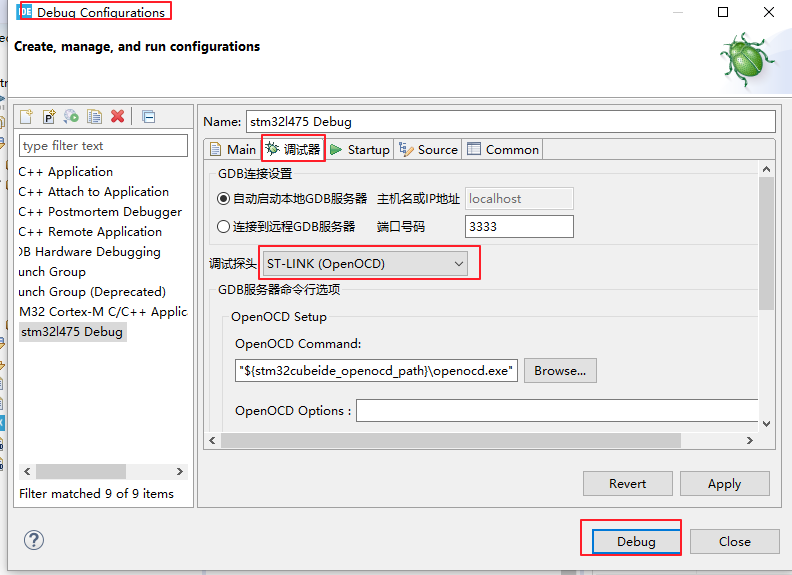

选择跳转窗口

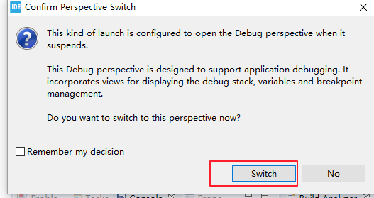

### 调试

调试界面如下所示

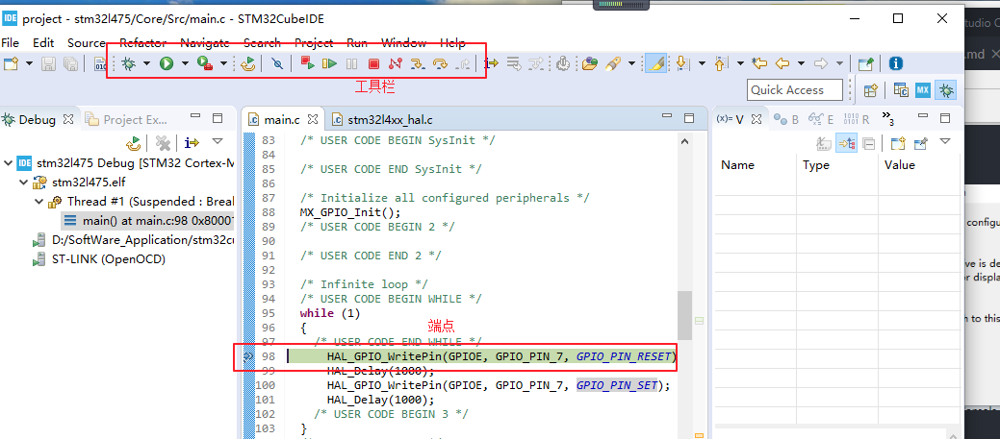

至此，基于 `CubeIDE` 的 `LED` 闪烁工程已经成功运行起来了，下一节就基于此工程移植 `threadx`
