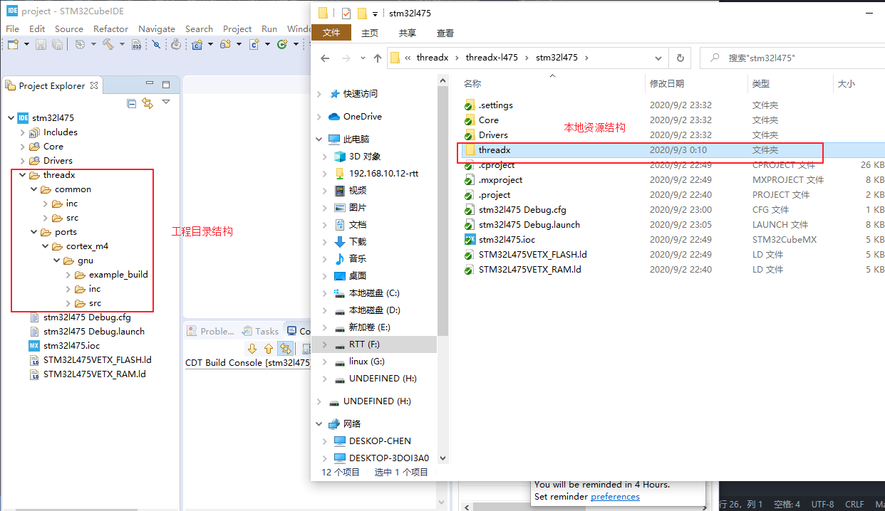
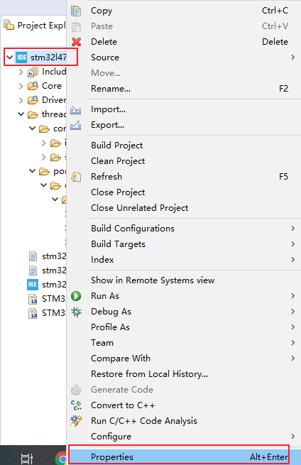
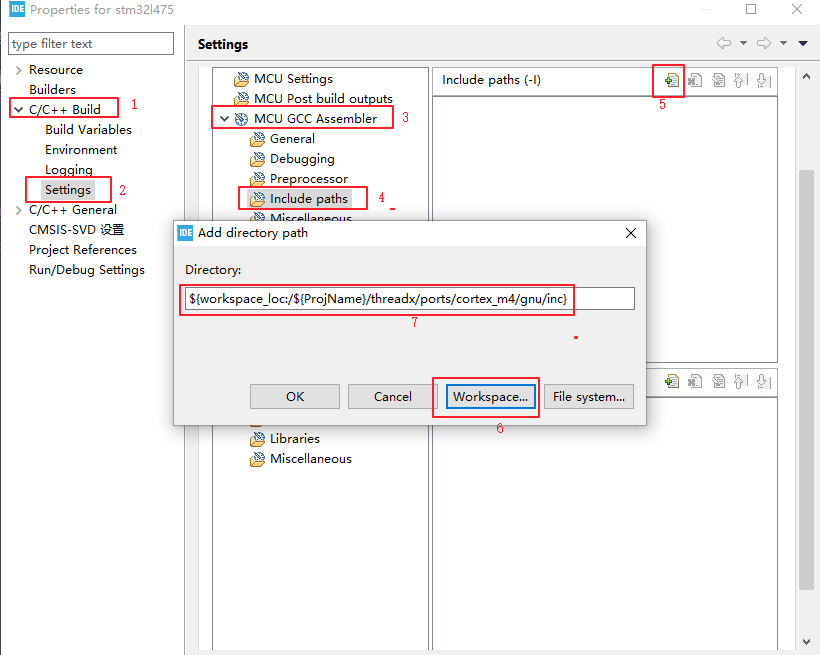
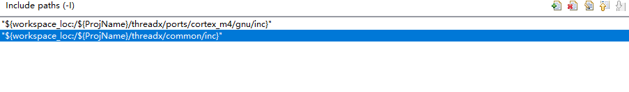
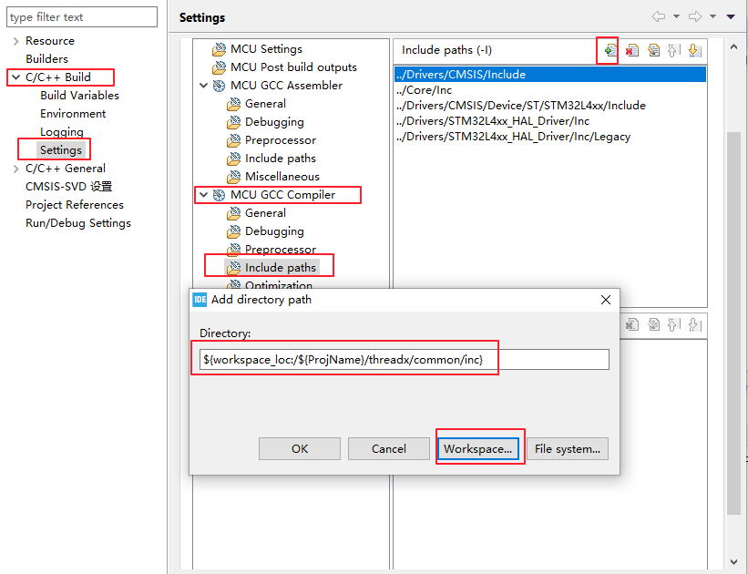
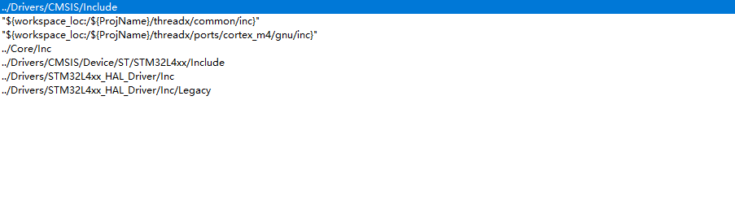
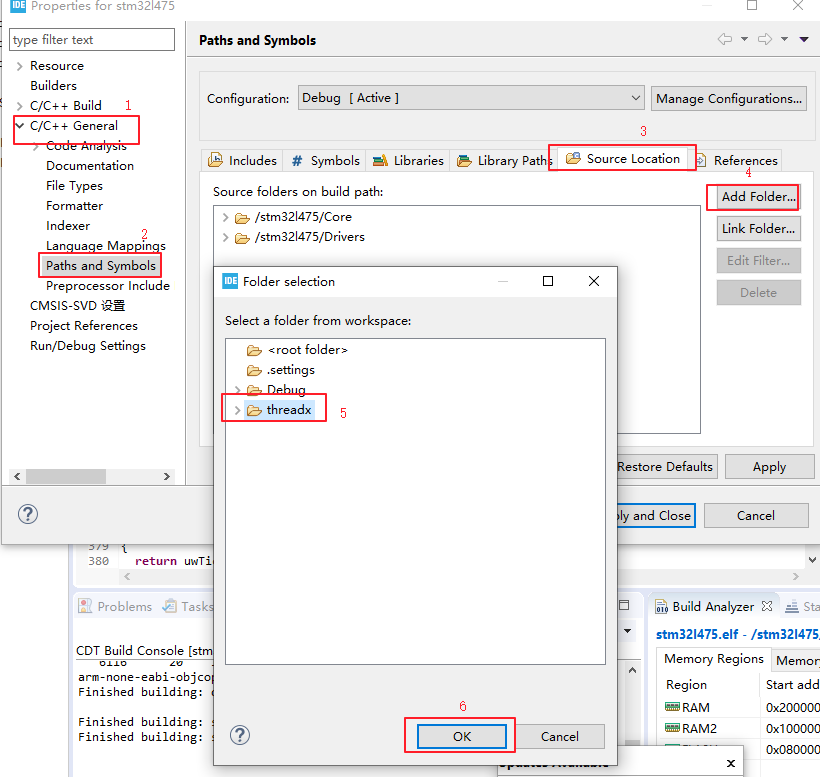
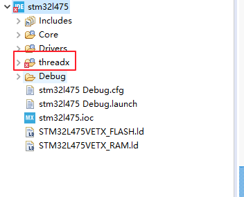
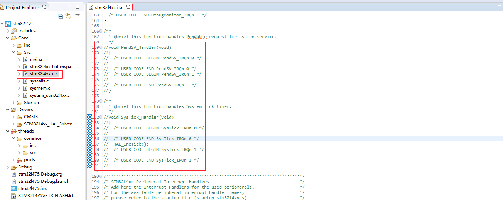

## CubeIDE 移植 threadx

本系列教程均基于正点原子 `L475` 潘多拉开发板为硬件平台。项目开源地址 [github 地址](https://github.com/tyustli/threadx-l475)

[threadx 移植(一)-CubeIDE 新建 LED 闪烁工程](https://blog.csdn.net/tyustli/article/details/108372510)

[threadx 移植(二)-基于 CubeIDE 移植 threadx](https://blog.csdn.net/tyustli/article/details/108373791)

### 下载 threadx 源码

[threadx 源码 github 仓库地址](https://github.com/azure-rtos/threadx.git)

### 移植所需要的全部文件

因为 stm32l475 使用的内核为 conter-m4，使用的开发环境为 `CubeIDE`,所以选择 `ports` 文件的时候选择 `cm4` 以及 `gnu`。

- `common/src` 文件夹下所有源文件
- `common/inc` 文件夹下所有头文件
- `ports/cortex_m4/gnu/src` 文件夹下所有源文件
- `ports/cortex_m4/gnu/inc` 文件夹下的所有头文件
- `ports/cortex_m4/gnu/example_build` 文件夹下的 `tx_initialize_low_level.S` 文件

以上所列即为移植 `threadx` 最小系统所需要的全部文件

### 添加源码到工程

将上述文件添加到本地工程的文件夹中，`CubeIDE` 会自动将文件的目录结构显示在工程中，如果没有显示刷新工程即可，添加完成之后工程目录如下所示：



工程目录结构和本地资源目录结构是一致的，这里只是修改了工程目录结构，但是源码并不会参与编译，而且头文件路径也没有设置。

### 添加头文件路径

右键工程，选择 `Properties` 属性，如下图所示



#### 添加汇编文件的头文件路径



汇编文件的头文件添加完成之后如下



#### C 文件的头文件路径



c 文件头文件路径添加完成之后如下图



汇编和 C 头文件添加完毕之后将设置保存

### 将源码参与编译



添加完成之后 `threadx` 文件夹会有一个 `c` 的标志，如下图所示



### 编译程序

将 `threadx` 源码加入工程参与编译后会报错，接下来就一个一个解决报错。

#### 中断服务函数重定义报错

```c
 multiple definition of `SysTick_Handler'
 multiple definition of `PendSV_Handler'
```

`threadx` 系统中会用到这两个中断服务函数，所以需要屏蔽掉 `stm32l4xx_it.c` 文件中工程自带的这两个中断服务函数。



#### 中断向量表未定义报错

```c
threadx/ports/cortex_m4/gnu/example_build/tx_initialize_low_level.S:114: undefined reference to `_vectors'
```

将 `tx_initialize_low_level.S` 文件中的 `_vectors` 换为自己的中断向量表，例如本例中 `startup_stm32l475vetx.s` 启动文件中定义了中断向量表为 `g_pfnVectors`，将其替换即可。

#### `__RAM_segment_used_end__` 未定义报错

```c
undefined reference to `__RAM_segment_used_end__'
```
需要在链接脚本中指定未使用的 `RAM` 地址，所以在链接脚本栈中栈结束的地方指定为 `RAM` 未使用的地址

```c
._user_heap_stack :
{
    . = ALIGN(8);
    PROVIDE ( end = . );
    PROVIDE ( _end = . );
    . = . + _Min_Heap_Size;
    . = . + _Min_Stack_Size;
    . = ALIGN(8);
    __RAM_segment_used_end__ = .;
} >RAM
```
至此，编译报错已经全部解决

### 启动操作系统内核

`main.c` 文件中包含 `threadx` 系统头文件 `tx_api.h` ，并在 `while(1)` 之前调用 `tx_kernel_enter()` 函数，此时会报错 

```c
undefined reference to `tx_application_define'
```

所以需要自己定义 `tx_application_define` 这个函数，并在这个函数中启动一个线程来进行 `LED` 的闪烁，示例代码如下：

```c
TX_THREAD               		demo_thread;
#define DEMO_STACK_SIZE         1024
static uint8_t thread_stack[DEMO_STACK_SIZE];

void demo_thread_entry(ULONG thread_input)
{
    /* This thread simply sits in while-forever-sleep loop.  */
    while(1)
    {
		HAL_GPIO_WritePin(GPIOE, GPIO_PIN_7, GPIO_PIN_RESET);
		tx_thread_sleep(1000);
		HAL_GPIO_WritePin(GPIOE, GPIO_PIN_7, GPIO_PIN_SET);
		tx_thread_sleep(1000);
    }
}
void tx_application_define(void *first_unused_memory)
{
    /* Create the main thread.  */
    tx_thread_create(&demo_thread,
					 "demo thread",
					 demo_thread_entry,
					 0,
					 thread_stack,
					 DEMO_STACK_SIZE,
					 1,
					 1,
					 TX_NO_TIME_SLICE,
					 TX_AUTO_START);
}

```

编译下载，可以看到 `LED` 已经成功的闪烁，至此，`threadx` 已经移植成功。