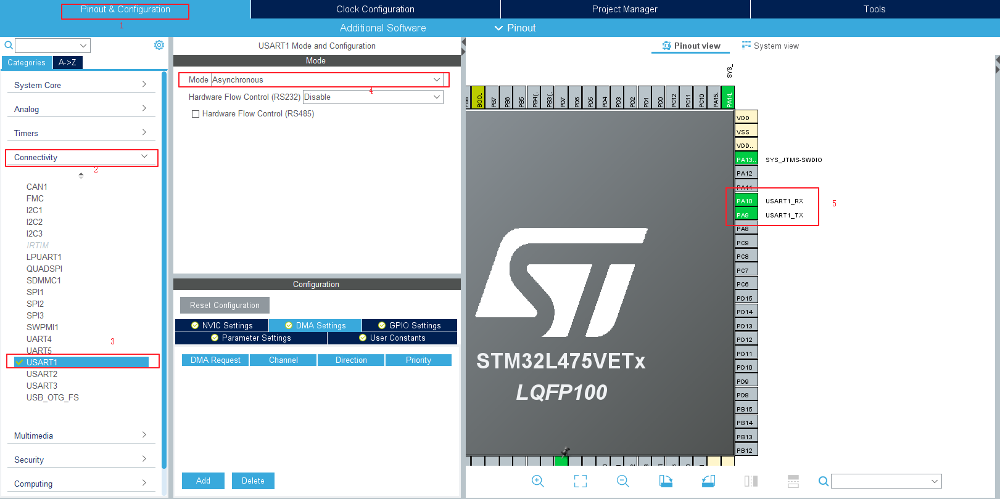
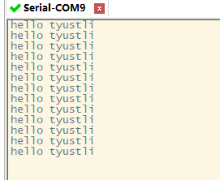

## threadx 添加串口打印功能


本系列教程均基于正点原子 `L475` 潘多拉开发板为硬件平台。项目开源地址 [github 地址](https://github.com/tyustli/threadx-l475)

[threadx 移植(一)-CubeIDE 新建 LED 闪烁工程](https://blog.csdn.net/tyustli/article/details/108372510)

[threadx 移植(二)-基于 CubeIDE 移植 threadx](https://blog.csdn.net/tyustli/article/details/108373791)

[threadx 移植(三)-添加串口打印功能](https://blog.csdn.net/tyustli/article/details/108380441)

### CubeMX 配置串口引脚

配置引脚如下图



### 实现输出重定向函数

`main.c` 文件中定义数组

```c
 char debug_buf[128];
```

`main.h` 文件中实现函数

```c
#include<stdio.h>
extern char debug_buf[128];
extern UART_HandleTypeDef huart1;
#define debug(...){ \
    int len = 0; \
    len = snprintf(debug_buf, 128, __VA_ARGS__); \
    if (len > 0) \
    { \
        HAL_UART_Transmit(&huart1, (uint8_t *)debug_buf, len, HAL_MAX_DELAY);\
    } \
}
```

### 新建线程输出打印

```c
#include "tx_api.h"
char debug_buf[128];

TX_THREAD               		led_thread;
TX_THREAD               		printf_thread;
#define DEMO_STACK_SIZE         4096
static uint8_t led_thread_stack[DEMO_STACK_SIZE];
static uint8_t printf_thread_stack[DEMO_STACK_SIZE];

void led_thread_entry(ULONG thread_input)
{
    /* This thread simply sits in while-forever-sleep loop.  */
    while(1)
    {
		HAL_GPIO_WritePin(GPIOE, GPIO_PIN_7, GPIO_PIN_RESET);
		tx_thread_sleep(1000);
		HAL_GPIO_WritePin(GPIOE, GPIO_PIN_7, GPIO_PIN_SET);
		tx_thread_sleep(1000);
    }
}

void printf_thread_entry(ULONG thread_input)
{
    while(1)
    {
    	debug("hello tyustli\r\n");
    	tx_thread_sleep(1000);
    }
}
void tx_application_define(void *first_unused_memory)
{
    /* Create the led thread.  */
    tx_thread_create(&led_thread,
					 "led thread",
					 led_thread_entry,
					 0,
					 led_thread_stack,
					 DEMO_STACK_SIZE,
					 1,
					 1,
					 TX_NO_TIME_SLICE,
					 TX_AUTO_START);

    /* Create the printf thread.  */
    tx_thread_create(&printf_thread,
					 "printf thread",
					 printf_thread_entry,
					 0,
					 printf_thread_stack,
					 DEMO_STACK_SIZE,
					 2,
					 2,
					 TX_NO_TIME_SLICE,
					 TX_AUTO_START);
}
```

串口输出结果如下



