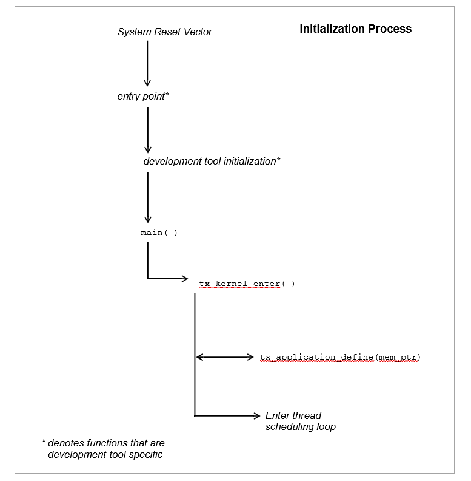
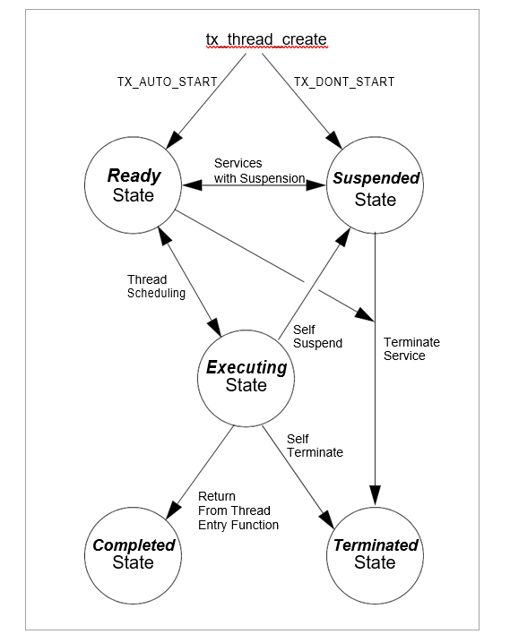

## 系统启动流程

[文档链接](https://docs.microsoft.com/en-us/azure/rtos/threadx/chapter3)

### 系统启动流程图



系统启动伪代码

```c
int main(void)
{
    /* 板级初始化 */
    HAL_Init();
    SystemClock_Config();
    MX_GPIO_Init();
    MX_USART1_UART_Init();

    /* 启动 threadx 内核*/
    tx_kernel_enter();
}

/* 自己的 threadx 相关的函数 */
#include "tx_api.h"
void tx_application_define(void *first_unused_memory)
{

}
```

### 线程状态切换图



`threadx` 中线程共有 `5` 中状态

- ready：就绪状态

- suspend：挂起状态

- executing：执行执行

- completed：完成状态

- terminated：终止状态

